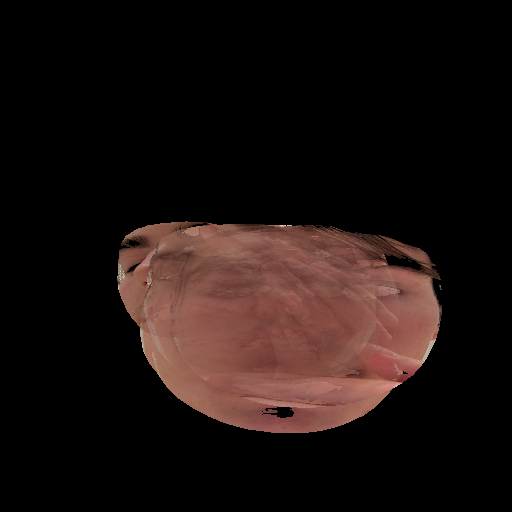
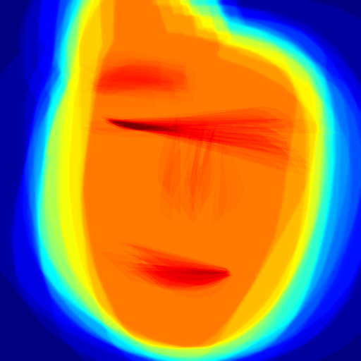

# ReFaceNet





ReFaceNet reconstructs a complete 2D face from multiple occluded or cropped images of the same person. It intelligently combines visible face parts from different images to create a unified facial reconstruction, handling partial occlusions, hand-covered faces, and cropped photos.

## How It Works
- **Smart Face Detection**: Detects faces even when partially occluded by hands or objects
- **Standardized Alignment**: Aligns all faces to a common template for consistent geometry
- **Multi-Scale Blending**: Combines visible regions at different detail levels for natural results
- **Coverage Analysis**: Tracks which facial regions are reconstructed vs missing
- **Quality Weighting**: Prioritizes clearer, higher-quality facial regions

## Key Features
- **2D Face Reconstruction**: Complete facial images from partial inputs
- **Occlusion Handling**: Works with hand-covered selfies and cropped photos
- **Multi-method landmark detection** with robust fallbacks
- **Feature-specific face masking** (eyes, nose, mouth, cheeks, forehead)
- **Real-time coverage heatmaps** showing reconstruction quality
- **Generation tracking** for iterative improvements

## Quick Start

### 1. Setup Environment
```bash
# Follow setup instructions in SETUP_GUIDE.md
conda create -y -n ReFaceNet python=3.10
conda activate ReFaceNet
pip install opencv-python mediapipe tqdm
```

### 2. Add Your Images
Put your face images (can be partially occluded) in `data/raw/`

### 3. Run Reconstruction
```bash
python run_pipeline_smart.py
```

### 4. View Results
- `outputs/latest_reconstruction.png` - Your reconstructed face
- `outputs/debug/` - Debug visualizations
- `face_reconstruction.log` - Detailed processing log

## Output Files
- `generation_X_reconstruction.png` - Numbered results for tracking progress
- `latest_reconstruction.png` - Always the most recent result
- `generation_X_heatmap.png` - Numbered coverage heatmaps showing which face regions were reconstructed
- `latest_heatmap.png` - Always the most recent coverage heatmap
- `generation_X_stats.json` - Processing statistics for each run
- `debug/` folder - Individual aligned images and landmark visualizations

## Understanding the Heatmap
The coverage heatmap shows which parts of the face were successfully reconstructed:
- **Red/Yellow**: High coverage - multiple input images contributed to this region
- **Green/Blue**: Medium coverage - some input images contributed  
- **Dark Blue/Black**: Low/no coverage - few or no input images had visible data for this region
